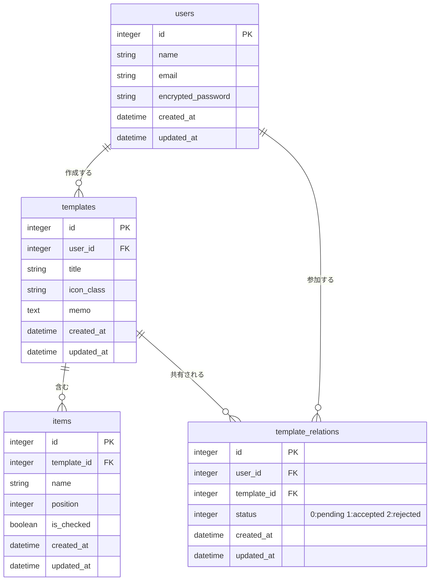
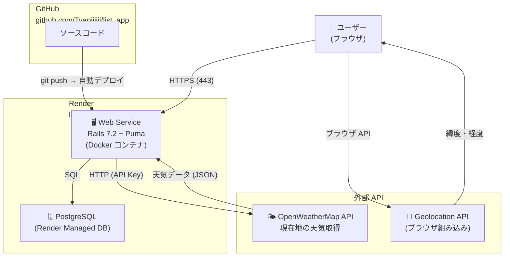

# 持ち物リストアプリ

> シーン別に持ち物テンプレートを登録・共有できる Web アプリです。

---

## スクリーンショット

| ログイン | テンプレート一覧 |
|---|---|
|  |  |

| テンプレート詳細（チェックリスト） | テンプレート作成 |
|---|---|
|  |  |

| テンプレート編集 | 通知 |
|---|---|
|  |  |

| アカウント設定 |
|---|
|  |

---

## サービス URL

https://list-app-8w0d.onrender.com/

## リポジトリ

https://github.com/Tyapiiiiii/list_app

---

## 概要

「旅行に行くたびに何か忘れた…」「毎回同じものをメモするのが面倒…」という経験から生まれた持ち物管理サービスです。

- **テンプレートに一度登録しておけば**、次回以降はチェックするだけで準備が完了します。
- **家族や友人を招待して**、旅行や仕事の荷物リストを一緒に管理できます。
- ゲストログインでサインアップなしに即試用できます。

---

## 開発背景

旅行やジムに行くたびに「あれ、持ったっけ？」となることが多く、毎回 Note アプリに同じものを書き直していました。  
シーン別にテンプレートを作っておけば次回からチェックするだけで準備が終わる仕組みを作りたいと思い、このアプリを開発しました。

また家族・友人と持ち物リストを共有したいシーンも多く（旅行の荷物分担など）、共同編集機能も実装しています。

---

## 機能と画面の説明

### ゲストログイン

サインアップ不要でアプリをお試しいただけます。以下の操作を気軽に体験できます。

| # | 操作 | 説明 |
|---|---|---|
| 1 | テンプレートの閲覧 | サンプルテンプレートの一覧をすぐ確認できます |
| 2 | テンプレートの作成 | アイコン・タイトル・持ち物を自由に登録できます |
| 3 | チェックリストの操作 | アイテムをクリックするだけで ON/OFF が切り替わります |
| 4 | アイテムの並び替え | ドラッグ＆ドロップで順序を変更できます |
| 5 | チェックの一括リセット | 「リセットして一覧に戻る」で全チェックを解除できます |
| 6 | テンプレートの共有招待 | 他ユーザーのメールアドレスを入力して共同編集に招待できます |
| 7 | 天気の確認 | 一覧ページで現在地の天気をリアルタイム表示します |

### 主な画面・機能

#### テンプレート一覧

- 自分が作成したテンプレートと、招待を承認した共有テンプレートを一覧表示
- アイコン（仕事・旅行・ジムなど 10 種）で視覚的に区別
- 現在地の天気を上部ウィジェットで表示（Geolocation API + OpenWeatherMap API）

#### テンプレート詳細（チェックリスト）

- アイテム名クリックでチェック ON/OFF をリアルタイム切り替え（Turbo Stream）
- 「リセットして一覧に戻る」で全チェックを一括解除
- メールアドレス入力で他ユーザーを共同編集者として招待

#### テンプレート作成・編集

- タイトル・メモ・アイコン・アイテムを一画面で設定
- アイテムの追加・削除・ドラッグ＆ドロップ並び替え

#### 通知

- 受け取った共有招待を一覧表示
- 承認 / 拒否を選択（承認するとテンプレートが自分の一覧に追加される）

#### アカウント設定

- プロフィール名・メールアドレスの変更
- パスワードの変更

---

## 工夫したところ

### Turbo Stream によるリアルタイムチェック切り替え

チェックボックスの ON/OFF はページ全体をリロードせず、Turbo Stream で該当アイテムの HTML だけを差し替えています。操作が即座に反映されるため、テンポよくチェックを進められます。

### acts_as_list による並び替え管理

`acts_as_list` gem でアイテムの `position` を自動管理しています。ドラッグ＆ドロップで順序を変更すると、Rails 側で `insert_at` を呼び出すだけで前後のポジションが自動で詰まります。

### テンプレート共有の権限管理

`TemplateRelation` 中間テーブルで `status（pending / accepted / rejected）` を管理することで、招待中・承認済み・拒否済みの状態を明確に区別しています。オーナーと共同編集者で操作できる機能を分離し、`accessible_items` / `owned_items` スコープで不正アクセスを防いでいます。

### ゲストログイン

`find_or_create_by!` で固定のゲストユーザーを使いまわす実装にすることで、サインアップ不要でアプリをお試しいただけるようにしました。

### 天気ウィジェット

一覧ページで Geolocation API + OpenWeatherMap API を組み合わせ、現在地の天気をリアルタイム表示しています。「今日は雨だから傘が必要」など、持ち物判断の参考にできます。

---

## 主な使用技術

| カテゴリ | 技術 |
|---|---|
| 言語 | Ruby 3.3.0 |
| フレームワーク | Ruby on Rails 7.2.3 |
| フロントエンド | Hotwire（Turbo + Stimulus）、importmap |
| 認証 | Devise |
| 並び替え | acts_as_list |
| 外部 API | OpenWeatherMap API |
| データベース | PostgreSQL（本番） / SQLite3（開発） |
| インフラ | Docker、Render |

---

## ER 図



---

## インフラ構成図



---

## 今後の展望

- [ ] テンプレートのお気に入り・ブックマーク機能
- [ ] テンプレートのカテゴリ・タグによる絞り込み検索
- [ ] 公開テンプレートのコミュニティ共有（他ユーザーのテンプレートをコピーして使用）
- [ ] アイテムへのコメント・メモ追加
- [ ] チェック完了時の達成率表示・アニメーション

---

## セットアップ（ローカル開発）

```bash
git clone <リポジトリURL>
cd list_app
bin/setup          # gem インストール・DB 作成・マイグレーション
bin/rails server   # http://localhost:3000 で起動
```

天気ウィジェットを使う場合は [OpenWeatherMap](https://openweathermap.org/api) の API キーが必要です。

```bash
bin/rails credentials:edit
```

```yaml
openweathermap:
  api_key: YOUR_API_KEY
```
