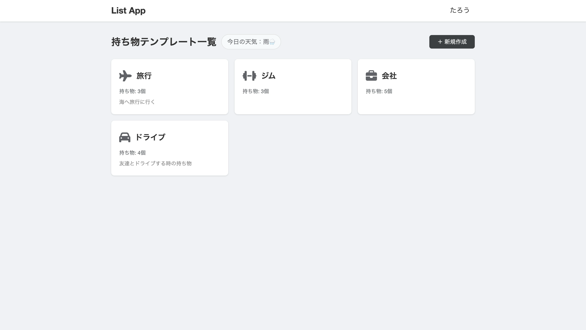
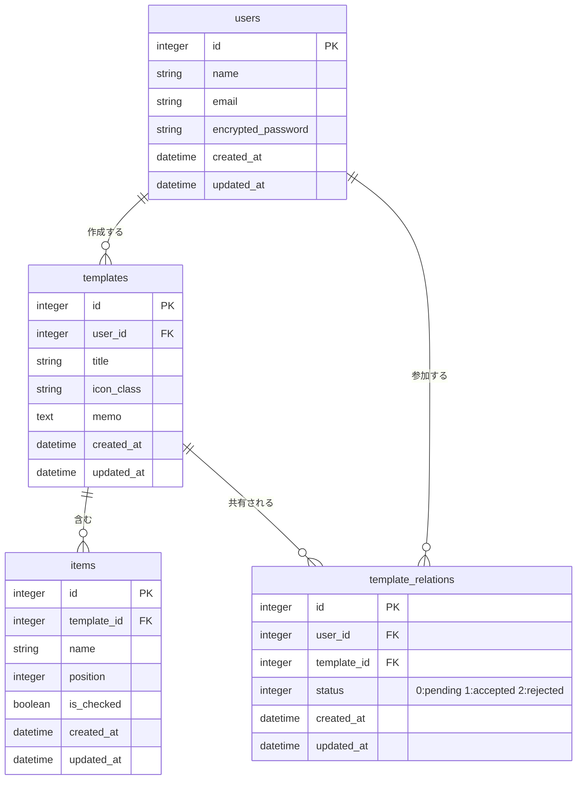

# 持ち物リストアプリ


## アプリの概要

場所・シーン別に持ち物リストをテンプレートとして登録・管理し、他のユーザーと共同編集できる Web アプリです。

---

## スクリーンショット



---

## アプリの使い方

### 1. アカウント登録 / ゲストログイン
- トップページからメールアドレスで新規登録、またはゲストログインボタンで即試用できます。

### 2. テンプレートの作成
- 「＋ 新規作成」ボタンからテンプレートを作成します。
- テンプレート名・メモ・アイコン（仕事・旅行・ジムなど10種）を設定し、持ち物を入力して保存します。

### 3. チェックリストの操作
- テンプレートをクリックするとチェックリスト画面が開きます。
- アイテム名をクリックするとチェックが ON/OFF に切り替わります（ページリロードなし）。
- 「リセットして一覧に戻る」で全チェックを一括解除できます。

### 4. テンプレートの共有
- チェックリスト画面の下部にメールアドレスを入力し、他のユーザーを招待します。
- 招待されたユーザーは通知画面から承認 / 拒否を選択できます。
- 承認後は共同でテンプレートを編集・チェック操作できます。

---

## なぜこれを作ったか

> ※ ご自身の開発動機をここに記入してください。
>
> （例）旅行やジムに行くたびに「あれ、何か忘れた気がする...」となることが多く、持ち物を毎回メモするのが面倒でした。  
> シーン別に持ち物テンプレートを登録しておけば、チェックするだけで準備が完了する仕組みを作りたいと思い開発しました。  
> また、家族や友人と持ち物リストを共有したいというニーズも想定して、共同編集機能も実装しました。

---

## 工夫したところ

### Turbo Stream によるリアルタイムチェック切り替え
チェックボックスの ON/OFF はページ全体をリロードせず、Turbo Stream で該当アイテムの HTML だけを差し替えています。操作が即座に反映されるため、テンポよくチェックを進められます。

### acts_as_list による並び替え管理
`acts_as_list` gem を利用してアイテムの `position` を自動管理しています。ドラッグ＆ドロップで順序を変更すると、Rails 側で `insert_at` を呼び出すだけで前後のポジションが自動で詰まります。

### テンプレート共有の権限管理
`TemplateRelation` 中間テーブルで `status（pending / accepted / rejected）` を管理することで、招待中・承認済み・拒否済みの状態を明確に区別しています。オーナーと共同編集者で操作できる機能を分離し、不正アクセスが起きないよう `accessible_items` / `owned_items` でスコープを絞っています。

### ゲストログイン
`find_or_create_by!` で固定のゲストユーザーを使いまわす実装にすることで、サインアップ不要でアプリをお試しいただけるようにしました。

### 天気ウィジェット
一覧ページで Geolocation API + OpenWeatherMap API を使い、現在地の天気をリアルタイムで表示しています。「今日は雨だから傘が必要」など、持ち物判断の参考にできます。

---

## ER図



---

## セットアップ

```bash
git clone <リポジトリURL>
cd list_app
bin/setup          # gem インストール・DB 作成・マイグレーションをまとめて実行
bin/rails server   # http://localhost:3000 で起動
```

### 環境変数

天気ウィジェットを使う場合は [OpenWeatherMap](https://openweathermap.org/api) の API キーが必要です。

```bash
bin/rails credentials:edit
```

```yaml
openweathermap:
  api_key: YOUR_API_KEY
```

## 動作環境

| 項目 | バージョン |
|---|---|
| Ruby | 3.3.0 |
| Rails | 7.2.3 |
| DB | SQLite3 |
=======
テンプレートを使って持ち物リストを管理・共有できる Web アプリです。

## 機能一覧

- **テンプレート管理** — 持ち物リストのテンプレートを作成・編集・削除
- **チェックリスト** — アイテムのチェック ON/OFF をリアルタイムで切り替え（Turbo Stream）
- **並び替え** — ドラッグ＆ドロップでアイテムの順序を変更
- **チェックリセット** — テンプレート内の全チェックを一括リセット
- **テンプレート共有** — 他のユーザーを招待して共同編集（承認 / 拒否）
- **通知** — 共有招待の通知一覧
- **ゲストログイン**

## 技術スタック

| カテゴリ | 技術 |
|---|---|
| 言語 | Ruby 3.3.0 |
| フレームワーク | Rails 7.2.3 |
| DB | SQLite3 |
| 認証 | Devise |
| フロントエンド | Hotwire（Turbo + Stimulus）、importmap |
| 並び替え | acts_as_list |
| インフラ | Docker |

## データモデル

```
User
 └─ has_many :templates
 └─ has_many :template_relations
 └─ has_many :shared_templates（承認済みのみ、through: template_relations）

Template
 └─ belongs_to :user
 └─ has_many :items（position 順）
 └─ has_many :template_relations
 └─ has_many :shared_users（承認済みのみ）

Item
 └─ belongs_to :template
 └─ position（acts_as_list）
 └─ is_checked（boolean）

TemplateRelation（中間テーブル）
 └─ belongs_to :user
 └─ belongs_to :template
 └─ status: pending / accepted / rejected
```

## セットアップ

### 前提条件

- Ruby 3.3.0
- Bundler
- SQLite3

## 主なルーティング

| メソッド | パス | 説明 |
|---|---|---|
| GET | `/` | テンプレート一覧（トップページ） |
| GET/POST | `/templates/new` | テンプレート作成 |
| GET | `/templates/:id` | テンプレート詳細（チェックリスト） |
| PATCH | `/templates/:id` | テンプレート更新 |
| POST | `/templates/:id/reset` | チェック一括リセット |
| POST | `/templates/:id/template_relations` | 共有招待の送信 |
| PATCH | `/template_relations/:id` | 招待の承認 / 拒否 |
| PATCH | `/items/:id/toggle_check` | アイテムのチェック切り替え |
| PATCH | `/items/:id/move` | アイテムの並び替え |
| GET | `/notifications` | 通知一覧 |
| POST | `/guest_login` | ゲストログイン |

